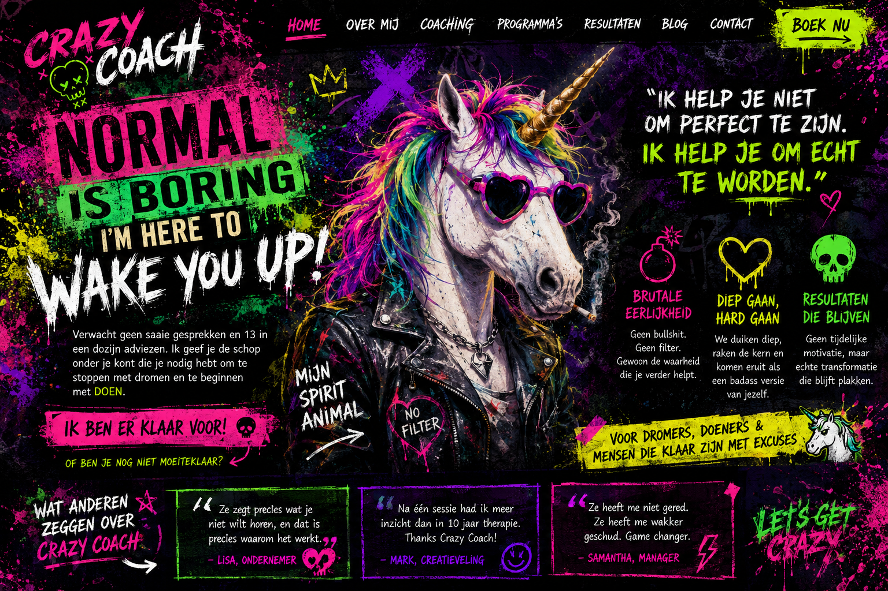

# crazycoach

Generated image: Geef je over aan de chaos

Yesterday 10:32 PM
Wat is een goede website voor een provocatieve coach wat info betreft

Ja. En ik zou de website niet opbouwen als een klassieke coachingssite met “Over mij / Diensten / Blog / Contact”. Juist bij Crazy Coach is de methode zelf het merk.

Wat ik uit de bronnen over provocatief coachen haal, is dat de kern eigenlijk heel mooi aansluit op jullie Crazy-concept: warmte + humor + uitdaging. De provocatie is niet het doel, maar het middel om iemand uit een vast patroon te krijgen.
Ik zou de informatie ongeveer zo structureren

1.  HOME
    De eerste vraag is niet “wie ben ik?”, maar:

        Ben jij klaar om jezelf eens flink in de weg te zitten?

Daarna heel kort:

Crazy Coach
Voor mensen die hun eigen bullshit inmiddels ook wel een beetje zat zijn.

En drie routes:

    Ik zit vast

    Ik wil veranderen

    Ik wil gewoon weten wat hier aan de hand is

Daaronder meteen een korte uitleg van de methode.

2. WAT IS PROVOCATIEF COACHEN?

Niet een droge methodiekpagina, maar juist:

    Ik ga je niet vertellen dat je gelijk hebt.
    Ik ga je ook niet vertellen dat alles jouw schuld is.
    Ik ga je waarschijnlijk wel vragen waarom je er al drie jaar over nadenkt zonder iets te doen.

Dan uitleggen dat provocatief coachen werkt met:

    warmte en waardering

    humor

    uitdaging

    overdrijving

    absurditeit

    onverwachte perspectieven

Dat zijn ook daadwerkelijk terugkerende elementen in de beschrijvingen van de methodiek.

Hier kun je de Crazy-versie helemaal los laten gaan.

Bijvoorbeeld een knop:

OKÉ, MAAR HOE DAN?!

3. VOOR WIE BEN JE?

Dit vind ik belangrijker dan een traditionele dienstenpagina.

Niet:

    “Ik coach professionals en particulieren.”

Maar bijvoorbeeld:
Herken je dit?

“Ik weet precies wat ik moet doen, maar ik doe het niet.”

“Ik heb alles geprobeerd.”

“Ik blijf maar nadenken.”

“Iedereen zegt dat ik goed bezig ben, maar zelf voelt het niet zo.”

“Ik wil veranderen, maar ik weet niet waar ik moet beginnen.”

“Misschien ben ik gewoon zo.”

En dan:

    Mooi. Daar kan ik wat mee.

4. HOE CRAZY IS CRAZY?

Dit zou ik echt als eigen onderdeel maken.

Want de grootste drempel bij provocatieve coaching is waarschijnlijk:

    “Wacht even... gaat deze vrouw mij nou serieus uitlachen?”

Dus juist transparant uitleggen:
Ja, ik ga je uitdagen.
Nee, ik ga je niet afbreken.

De relatie blijft gebaseerd op warmte, respect en vertrouwen. De humor en provocatie zijn bedoeld om patronen los te maken, niet om iemand belachelijk te maken. Dat onderscheid komt ook expliciet terug in beschrijvingen van provocatieve coaching.

Dit is inhoudelijk belangrijk én geeft Crazy Coach geloofwaardigheid.

5. OVER DE CRAZY COACH

Hier zou ik juist heel menselijk worden.

Geen standaard:

    “Mijn naam is X en ik help mensen hun volledige potentieel te bereiken.”

Maar:
Wie de fuck ben ik?

Foto.

Een paar harde feiten.

Een paar rare feiten.

Waarom ze dit doet.

Waar ze zelf mee geworsteld heeft.

Wat mensen aan haar hebben.

En misschien:

    Mijn spirit animal is een unicorn.
    Dat zegt waarschijnlijk genoeg.

Dat maakt de unicorn opeens onderdeel van het verhaal in plaats van alleen een leuk plaatje.

6. COACHING

Hier pas het concrete aanbod.

Bijvoorbeeld:
Eén sessie

De schop onder je kont

90 minuten.
Traject

Van WTF naar WTF?!

6 sessies.
Voor teams

Stop met vergaderen. Begin met veranderen.

En bij iedere dienst:

Voor wie → wat gebeurt er → wat levert het op → prijs → boeken

Dus niet twintig alinea's uitleg.

7. RESULTATEN

Niet alleen testimonials.

Ik zou het bijna als een “before / after”-machine vormgeven.
VOOR NA
“Ik moet eerst nadenken.” “Ik heb het gedaan.”
“Ik weet niet wat ik wil.” “Ik weet wat ik ga doen.”
“Maar wat als...” “Fuck it.”
37 openstaande tabbladen 1 concrete actie

En daaronder echte klantverhalen.

8. DE UNICORN

Ik zou dit zelfs een eigen terugkerend concept maken.

Niet:

    “Onze mascotte is een unicorn.”

Maar:
Waarom een fucking unicorn?

Een unicorn is absurd.

Onwaarschijnlijk.

Een beetje overdreven.

En toch bestaat-ie.

Dat kan een metafoor worden voor:

    Misschien hoef je jezelf niet realistischer te maken.
    Misschien moet je jezelf eens wat minder normaal maken.

Dan krijgt dat hele gestoorde visuele ontwerp ineens inhoudelijke betekenis.
En dan wordt jullie idee van twee themes echt interessant

Ik zou ze eigenlijk niet Light / Dark noemen.

Maar:

CRAZY MODE 🤘
en
SERIOUS MODE

Of nog beter:

🦄 CRAZY
BUSINESS

En de informatie blijft 100% hetzelfde.

Alleen de presentatie verandert.

In Crazy:

    JE PROBLEEM IS NIET DAT JE TE WEINIG POTENTIEEL HEBT.
    JE PROBLEEM IS DAT JE ER VERDOMD VEEL MEE KUNT.

In Business:

    Provocatieve coaching helpt mensen vastzittende patronen te doorbreken door warmte, humor en uitdaging te combineren.

Dat is volgens mij precies waar het concept sterk wordt: de website demonstreert de filosofie van de coach.

Je hoeft niet alleen te vertellen dat ze provocatief is.
De bezoeker ervaart het al voordat hij één sessie heeft geboekt.

En dat is inhoudelijk ook goed te verdedigen, want provocatieve coaching draait juist om het doorbreken van verwachtingen, patronen en vastgeroeste manieren van kijken.

Als je wilt, kan ik hierna ook de
complete sitemap + teksten per pagina voor Crazy Coach uitwerken, waarbij ik voor iedere pagina meteen
Crazy-versie én Business-versie maak. Dat lijkt me eigenlijk een heel leuk concept om samen scherp te krijgen.

Today 9:46 AM
Maak een complete sitemap en teksten per pagina voor Crazy Coach

Ja. Ik zou er een echte merkwebsite van maken, niet een verzameling coachingspagina's. De inhoud moet vertrouwen geven, maar de vorm mag voortdurend een beetje tegen de bezoeker schoppen.

Ik heb daarbij de inhoudelijke basis van provocatief coachen meegenomen: warmte, humor en uitdaging zijn de drie terugkerende pijlers. Belangrijk is ook dat de provocatie niet tegen de persoon gericht is, maar tegen diens vastzittende verhaal, overtuigingen of patronen.
Sitemap

CRAZY COACH
│
├── Home
│
├── Wat is dit?
│ ├── Provocatief coachen
│ ├── Hoe werkt het?
│ └── Crazy ≠ gemeen
│
├── Voor wie?
│ ├── Ik zit vast
│ ├── Ik weet wat ik moet doen
│ └── Ik durf het niet
│
├── Coaching
│ ├── 1-op-1 coaching
│ ├── Coachingtraject
│ └── Voor teams / organisaties
│
├── Over mij
│
├── Resultaten
│
├── FAQ
│
└── Contact / Boek een gesprek

En ik zou Blog voorlopig niet in de hoofdnavigatie zetten. Alleen doen als ze daadwerkelijk regelmatig iets te vertellen heeft. Anders krijg je zo'n treurig tabje met “Laatste bericht: maart 2025”.

Hieronder de eerste complete versie. De stukken tussen [ ] zijn bewust plekken waar we nog echte gegevens van je zus nodig hebben.
Crazy Coach – complete websitecopy
CRAZY COACH
01 HOME
HERO
JE BENT NIET GEK.
JE BENT GEWOON NOG NIET KLAAR.

Crazy Coach

Coaching voor mensen die diep van binnen best weten wat ze willen.

Maar het ondertussen tóch al een tijdje niet doen.

Ik help je om weer in beweging te komen.

[PLAN EEN GESPREK]
[WAT IS PROVOCATIEF COACHEN?]
EVEN SERIEUS

Je hebt erover nagedacht.

Veel.

Misschien té veel.

Je weet wat er anders moet. Je hebt podcasts geluisterd, boeken gelezen, lijstjes gemaakt, goede voornemens gehad en waarschijnlijk minstens één keer tegen jezelf gezegd:

“Vanaf maandag ga ik het echt anders doen.”

En toen werd het dinsdag.

Herkenbaar?

Mooi.

Dan hebben we iets om mee te werken.
GEEN BRAAF COACHINGSGESPREK

Ik ga niet tegenover je zitten met een notitieblok en na iedere zin zeggen:

"En wat doet dat met je?"

Ik luister wel.

Ik neem je serieus.

Maar ik neem niet automatisch alles serieus wat jij over jezelf vertelt.

Dat is nogal een verschil.

Ik gebruik humor, scherpte en provocatie om patronen zichtbaar te maken.

Niet om jou onderuit te halen.

Wel om datgene wat jou tegenhoudt eens flink door elkaar te schudden.
MIJN DRIE SUPERKRACHTEN
❤️ WARMTE

Je hoeft bij mij niets te bewijzen.

Ik ben vóór jou.

Ook als ik je ondertussen genadeloos wijs op de onzin die je jezelf vertelt.
😂 HUMOR

Sommige problemen worden niet kleiner door er nóg serieuzer naar te kijken.

Soms moet je er eerst eens om kunnen lachen.
⚡ UITDAGING

Je kunt heel lang praten over verandering.

Maar uiteindelijk moet er iets gebeuren.

Daar kom ik om de hoek kijken.
MIJN SPIRIT ANIMAL?
🦄 DE UNICORN.

Waarom?

Omdat normaal nogal overschat wordt.

Een unicorn is onmogelijk, kleurrijk, een tikje absurd en volledig zichzelf.

Dat lijkt me een prima levenshouding.
MISSCHIEN IS DIT WEL JOU

“Ik weet precies wat ik moet doen.”

Doe je het?

“Ik wil eigenlijk iets anders.”

Waarom doe je dat dan niet?

“Ik blijf maar twijfelen.”

Waar wacht je precies op?

“Ik heb alles al geprobeerd.”

Echt alles?

“Ik heb gewoon iemand nodig die me even wakker schudt.”

Hallo.
KLAAR MET PRATEN?

Niet iedereen heeft nóg een inzicht nodig.

Soms heb je een schop nodig.

Een spiegel.

Een ander perspectief.

Of een irritant vrolijke coach die weigert mee te gaan in jouw verhaal.

Misschien ben ik die coach.

[IK WIL KENNISMAKEN]
02 WAT IS PROVOCATIEF COACHEN?
PROVOCATIEF?

JA.

GEMEEN?

NEE.

Provocatief coachen is een manier van coachen waarbij ik je niet alleen vragen stel, maar je ook bewust uitdaag.

Met humor.

Met warmte.

Met overdrijving.

Met onverwachte perspectieven.

En soms met een uitspraak waarvan je denkt:

“Zegt ze dit nou echt?”

Ja.

Maar altijd met een reden.

Provocatief coachen wordt beschreven als een combinatie van warmte, humor en uitdaging. De bedoeling is niet om iemand af te wijzen, maar juist om vastzittende patronen en overtuigingen los te maken.
WAT GEBEURT ER DAN?

Jij vertelt mij je probleem.

Ik luister.

En vervolgens kan het gebeuren dat ik jouw probleem een beetje groter maak.

Absurd groot.

Of ik neem jouw overtuiging volledig serieus.

Zó serieus dat hij vanzelf belachelijk wordt.

Of ik speel even advocaat van de duivel.

Of ik zeg hardop wat jij zelf allang denkt.

Waarom?

Omdat je soms pas ziet hoe vast je zit wanneer iemand het patroon een kwartslag draait.
IK PROVOCEER JOU NIET.
IK PROVOCEER JE VERHAAL.

Dat onderscheid is belangrijk.

Ik ben niet tegen jou.

Ik ben juist vóór jou.

Maar dat betekent niet dat ik alles geloof wat je over jezelf zegt.

Je bent niet je probleem.

Je bent niet je angst.

Je bent niet je uitstelgedrag.

En je bent al helemaal niet verplicht om de rest van je leven hetzelfde verhaal te blijven vertellen.
DE CRAZY COCKTAIL
WARMTE

Er is vertrouwen.

Ik ben betrokken.

Ik wil dat het goed met je gaat.
HUMOR

We mogen lachen.

Ook om moeilijke dingen.

Humor kan afstand creëren tot een probleem en ruimte geven voor een ander perspectief.
UITDAGING

En vervolgens gaan we kijken wat je daadwerkelijk gaat doen.

Want inzicht is leuk.

Beweging is leuker.
CRAZY ≠ GECONTROLEERDE CHAOS

Er zit een methode achter.

Provocatief coachen betekent niet dat ik zomaar alles roep wat in me opkomt.

De stijl vraagt juist om een goede balans tussen warmte, humor en uitdaging. Zonder die basis kan provocatie als afwijzing of aanval worden ervaren.

Dus ja:

Ik kan je uitdagen.

Ik kan je plagen.

Ik kan je compleet op het verkeerde been zetten.

Maar ik laat je niet vallen.
03 VOOR WIE?
VOOR MENSEN DIE KLAAR ZIJN MET HUN EIGEN GEDOE.

Misschien herken je jezelf hierin.
IK ZIT VAST

Je weet dat je iets wilt veranderen.

Je weet misschien zelfs precies wat.

Maar iedere keer kom je weer op hetzelfde punt uit.

Je denkt.

Je twijfelt.

Je analyseert.

Je stelt uit.

En vervolgens analyseer je waarom je uitstelt.

Welkom bij de club.
IK WEET WAT IK MOET DOEN

Dit is misschien wel de irritantste categorie.

Want je weet het al.

Je hoeft geen informatie.

Je hoeft geen nieuw boek.

Je hoeft waarschijnlijk geen nieuwe podcast.

Je moet iets dóén.

En daar kunnen we het over hebben.
IK WIL IETS ANDERS

Een andere baan.

Een andere relatie met werk.

Meer ruimte.

Meer lef.

Een eigen bedrijf.

Een keuze maken.

Een grens trekken.

Of gewoon eindelijk eens ophouden met doen alsof alles prima gaat.

Dan beginnen we daar.
IK BEN MIJN EIGEN PROBLEEM

Je bent perfectionistisch.

Je wilt iedereen tevreden houden.

Je maakt alles groter dan het is.

Je bent bang om te falen.

Of juist om succesvol te worden.

Je zegt vaak ja terwijl je nee bedoelt.

Je wacht op het perfecte moment.

Nieuwsflits:

Dat moment bestaat waarschijnlijk niet.
NIET VOOR IEDEREEN

Crazy Coach is waarschijnlijk niets voor je als je vooral iemand zoekt die zegt:

"Wat vervelend voor je."

En vervolgens een kopje thee inschenkt.

Ik luister.

Ik heb empathie.

Ik neem je serieus.

Maar ik ga je ook uitdagen.

Als je daar niet tegen kunt, zijn er gelukkig heel veel andere coaches.

Geen probleem.
04 COACHING
HOE KUN JE MET MIJ AAN DE SLAG?
DE KENNISMAKING

[30 / 45 / 60] minuten

Een eerste gesprek.

Geen verplichtingen.

Geen verkooppraatje.

Gewoon kijken:

Is er een klik?

Is dit iets voor jou?

En ben ik de juiste persoon om je hierbij te helpen?

[PLAN EEN KENNISMAKING]
1-OP-1 COACHING

Voor als je ergens tegenaan loopt en daar niet alleen uitkomt.

We kijken naar wat er speelt.

Wat je denkt.

Wat je doet.

Wat je niet doet.

En vooral:

waarom je blijft doen wat je doet terwijl je zegt dat je het anders wilt.

[MEER OVER 1-OP-1]
HET CRAZY COACH TRAJECT

Een traject voor als één gesprek niet genoeg is.

We gaan niet eindeloos praten.

We gaan onderzoeken.

Uitdagen.

Experimenteren.

Lachen.

En vooral:

bewegen.

Het exacte programma, aantal sessies en investering vind je hier:

[BEKIJK HET TRAJECT]
VOOR TEAMS & ORGANISATIES

Ook organisaties zitten soms vast.

In vergaderingen.

In patronen.

In gedoe.

In "zo doen we dat hier nu eenmaal".

Ik help teams om eens anders naar hun situatie te kijken.

Met humor.

Met scherpte.

En met genoeg veiligheid om ook daadwerkelijk iets te kunnen zeggen.

[IK WIL DIT BESPREKEN]
05 OVER MIJ
WIE IS DIE CRAZY COACH?
EERST EVEN DIT.

Ik ben [NAAM].

Coach.

Mens.

Unicorn-fan.

En waarschijnlijk niet de coach die je moeder voor je had uitgezocht.
WAAROM IK DIT DOE

[HIER KOMT HAAR EIGEN VERHAAL]

Geen glad marketingverhaal.

Gewoon het echte verhaal.

Waar komt haar fascinatie voor mensen vandaan?

Wat heeft ze zelf meegemaakt?

Wanneer ontdekte ze provocatief coachen?

Waarom werkt deze manier van coachen voor haar?

Wat heeft ze geleerd?

En waarom denkt ze dat andere mensen hier iets aan kunnen hebben?
WAT JE VAN MIJ KUNT VERWACHTEN

Ik luister.

Ik stel vragen.

Ik daag je uit.

Ik maak grapjes.

Ik zeg soms dingen die je liever niet hoort.

En ik ben er ook als het even niet grappig is.

Want uiteindelijk gaat het niet om mijn stijl.

Het gaat om jou.

Mijn doel is niet dat je denkt:

"Wat een geweldige coach."

Mijn doel is dat je na afloop denkt:

"Fuck. Ik weet wat ik nu moet doen."
06 RESULTATEN
WAT LEVERT HET OP?

Geen wondermiddelen.

Geen gegarandeerde transformatie.

Geen "word de beste versie van jezelf in vijf stappen".

Wel de mogelijkheid om anders naar jezelf, je patronen en je keuzes te kijken.

En vervolgens iets te doen met wat je ontdekt.
VOORBEELDEN
VAN

"Ik moet eerst zeker weten dat dit de juiste keuze is."
NAAR

"Ik kan een keuze maken en daarna kijken wat er gebeurt."
VAN

"Ik ben nu eenmaal perfectionistisch."
NAAR

"Misschien gebruik ik perfectionisme soms als excuus om niet te beginnen."
VAN

"Ik weet niet wat ik wil."
NAAR

"Ik weet eigenlijk best wat ik wil. Ik vind alleen de consequenties spannend."
WAT ZEGGEN ANDEREN?

Hier komen echte testimonials.

[TESTIMONIAL 1]

    "[KORTE QUOTE]"

[NAAM / FUNCTIE]

[TESTIMONIAL 2]

    "[KORTE QUOTE]"

[NAAM / FUNCTIE]

[TESTIMONIAL 3]

    "[KORTE QUOTE]"

[NAAM / FUNCTIE]
GEEN TESTIMONIALS?

Dan liever géén nepquotes.

We kunnen ook werken met:

Wat klanten meenamen uit een traject

    meer duidelijkheid

    meer eigenaarschap

    een ander perspectief

    meer lef

    concrete acties

Maar zodra er echte klantverhalen zijn:

Die moeten hier komen.
07 FAQ
IS PROVOCATIEF COACHEN HETZELFDE ALS IEMAND AFZEIKEN?

Nee.

Sterker nog, de basis van provocatief coachen is juist warmte en betrokkenheid.

Ik neem jou serieus.

Ik neem alleen niet automatisch elk verhaal dat je over jezelf vertelt serieus.
GA JE MIJ VOOR SCHUT ZETTEN?

Hopelijk niet.

Tenzij we samen besluiten dat een beetje ongemak precies is wat nodig is.

Provocatie hoort binnen een veilige coachrelatie en vraagt om afstemming.
WAT ALS IK NIET VAN HUMOR HOUD?

Dan wordt het interessant.

Provocatief coachen hoeft niet te betekenen dat we de hele tijd lachen.

Humor is een middel.

Geen verplicht programmaonderdeel.
WAT ALS IK EMOTIONEEL WORD?

Dan stoppen we met grappig doen.

Er is ruimte voor alles wat er is.

Warmte komt vóór de grap.
KAN IK OOK KOMEN ALS IK GEEN GROOT PROBLEEM HEB?

Absoluut.

Je hoeft niet eerst volledig vast te lopen voordat je iets mag veranderen.

Misschien wil je een keuze maken.

Een patroon doorbreken.

Een idee onderzoeken.

Of gewoon eens hardop zeggen wat je normaal inslikt.
HOEVEEL SESSIES HEB IK NODIG?

Geen idee.

En dat is een serieus antwoord.

Dat hangt af van je vraag, je doel en wat je nodig hebt.

We kunnen daar tijdens de kennismaking eerlijk naar kijken.
IS DIT THERAPIE?

[HIER MOET HAAR EIGEN PROFESSIONELE AFBAKENING KOMEN]

Als Crazy Coach coaching aanbiedt en geen psychologische behandeling of therapie, moet dat hier helder worden uitgelegd.
KAN IK OOK ONLINE COACHING KRIJGEN?

[JA / NEE / BEIDE]

[MEER INFORMATIE]
08 CONTACT
OKÉ.
ZULLEN WE DAN?

Je hoeft nog niets te weten.

Je hoeft geen perfecte coachvraag te hebben.

Je hoeft zelfs niet precies te kunnen uitleggen wat er aan de hand is.

Vertel gewoon:

waar loop je tegenaan?

[CONTACTFORMULIER]

Naam
E-mail
Telefoonnummer [optioneel]
Waar wil je over praten?
[BERICHT]

[VERSTUUR]
OF STUUR GEWOON EEN BERICHT

[E-MAILADRES]

Ik beloof dat ik niet meteen een funnel over je heen gooi.
09 FOOTER

CRAZY COACH

Warmte. Humor. Uitdaging. En een beetje unicorn.

[Instagram]
[LinkedIn]
[E-mail]

Coaching | Over mij | FAQ | Contact

© [JAAR] Crazy Coach
Privacy | Algemene voorwaarden
En dan komt het leuke deel

Ik zou deze zelfde teksten niet letterlijk twee keer schrijven.

De website krijgt één contentmodel, met twee presentatielagen:
Onderdeel 🦄 Crazy mode Business mode
Typografie Handwritten, punk, absurd groot Rustig, professioneel
Kleur Neon, roze, groen, geel, paars Wit, zwart, neutrale accentkleur
Layout Scheef, overlappend, chaotisch Grid, veel witruimte
Foto's Unicorn, stickers, graffiti Professionele fotografie
Buttons JA FUCK IT Plan een kennismaking
Headings JE WEET HET AL. Je weet wat je wilt veranderen
Navigatie Speels en onverwacht Klassiek
Microcopy Brutaal Zakelijk
Animatie Veel beweging Subtiel
Inhoud Exact hetzelfde Exact hetzelfde

Dat laatste vind ik belangrijk. Geen dark/light theme, maar een personality switch.

De bezoeker kan bijvoorbeeld rechtsboven kiezen:

    🦄 CRAZY / BUSINESS

En vervolgens verandert de complete interface.

In Crazy mode wordt bijvoorbeeld:

    WAT IS PROVOCATIEF COACHEN?

PROVOCATIEF? JA. GEMEEN? NEUH.

In Business mode wordt dat:

    Wat is provocatieve coaching?

Een coachingsmethode gebaseerd op warmte, humor en uitdaging.

Dat sluit bovendien verrassend goed aan op de methodiek zelf. Provocatief coachen is juist bedoeld om verwachtingen en vastgeroeste patronen te doorbreken, terwijl de verbinding met de cliënt behouden blijft.

Mijn volgende stap zou niet nóg meer pagina's schrijven zijn. Ik zou eerst de Crazy Coach merktaal vastleggen: ongeveer 20 kernzinnen, verboden woorden, typische grappen, unicorn-regels en de grens tussen provocatief en gewoon irritant. Daarna kunnen we de Business-versie daar heel strak uit afleiden. Dat maakt het concept veel sterker.
